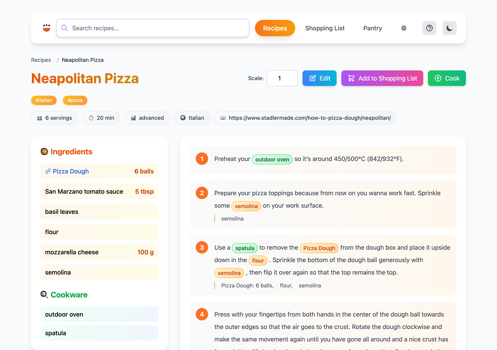
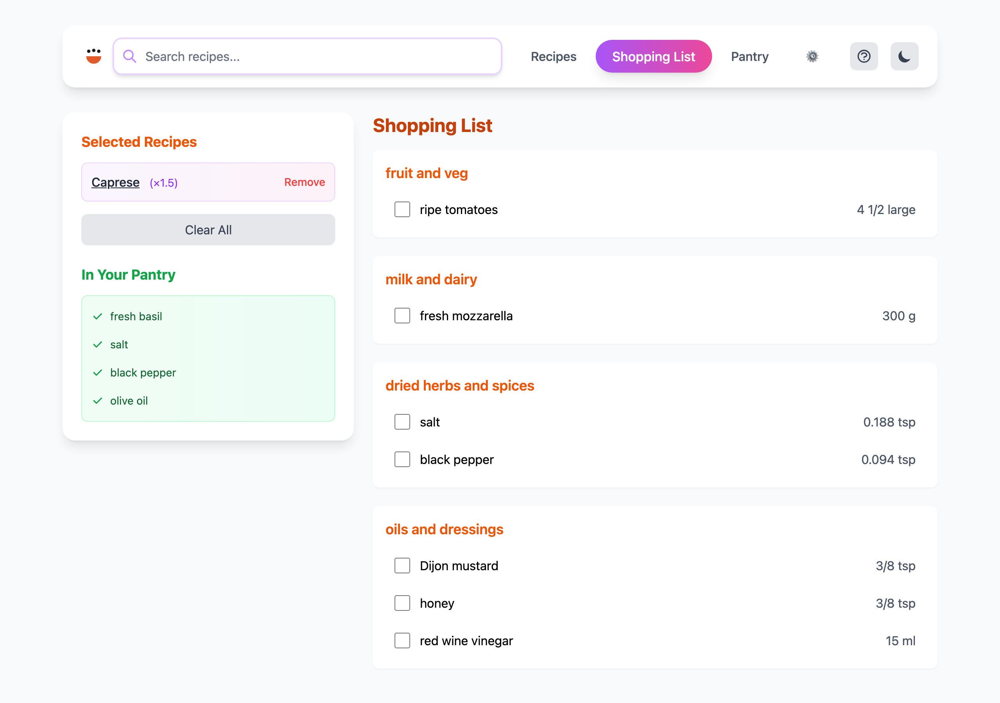
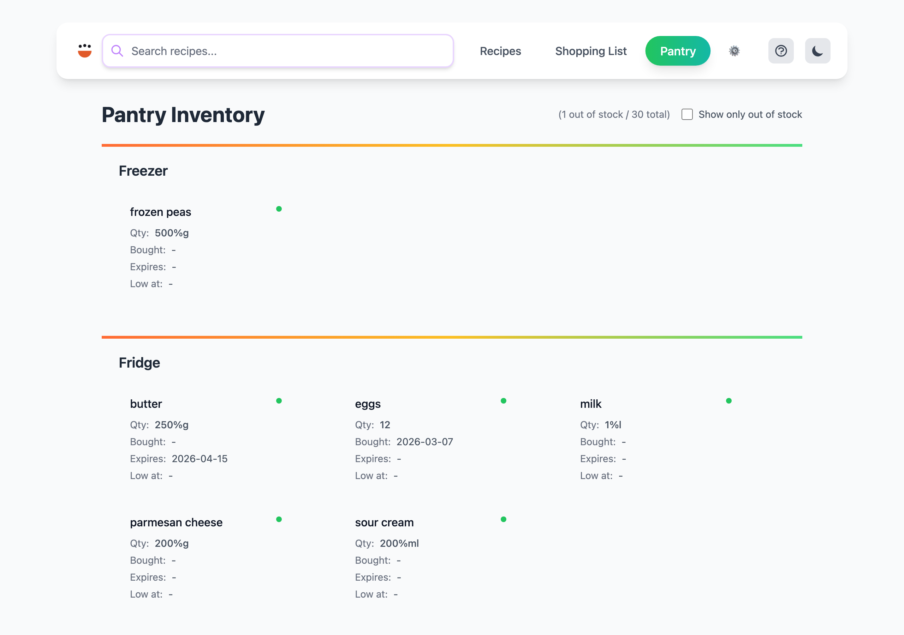

# Server Command

Start a local web server to browse and view your recipe collection.






## Usage

```
cook server [OPTIONS] [BASE_PATH]
```

## Arguments

| Argument | Description |
|----------|-------------|
| `[BASE_PATH]` | Root directory containing recipe files (default: current directory) |

## Options

| Option | Description |
|--------|-------------|
| `--host [<ADDRESS>]` | Allow connections from external hosts (default: localhost only). Optionally bind to a specific address. |
| `-p, --port <PORT>` | Port number (default: 9080) |
| `--open` | Automatically open the web interface in your default browser |

## Examples

```bash
# Start on localhost:9080
cook server

# Serve recipes from a specific directory
cook server ~/my-recipes

# Custom port with auto-open
cook server --port 8080 --open

# Allow access from other devices on the network
cook server --host
```

## Notes

- By default, only accepts connections from localhost
- Use `--host` on trusted networks only — recipes become accessible to anyone on the network
- The web interface supports recipe browsing, scaling, search, and shopping list management
- The UI language is negotiated per request from the browser's `Accept-Language` header — each visitor sees the interface in their own language (supported: `en-US`, `de-DE`, `nl-NL`, `fr-FR`, `es-ES`, `eu-ES`, `sv-SE`). For static sites, see the `--lang` flag of [`cook build web`](build.md#localization).
- Mobile-friendly responsive layout

## Custom Metadata Families (e.g. Nutrition)

Beyond the [standard Cooklang metadata keys](https://cooklang.org/docs/spec/#canonical-metadata) (`servings`, `time`, `course`, `author`, ...), any YAML frontmatter key whose value is a **list** is shown on the recipe page as its own line below the tags, grouped by key — one line per family.

```yaml
---
tags:
  - vegan
  - gluten-free
nutrition:
  - 258%kcal
  - 4.2%g of proteins
  - 4.8%g of lipids
  - 39.4%g of sugars
  - 5.3%g of fibers
allergens:
  - gluten
  - tree nuts
---
```

- Each entry is written as `value%unit` (e.g. `258%kcal`); the `%` is replaced with a space when displayed (`258 kcal`). Entries without a `%` are shown as-is.
- The family label is the YAML key, capitalized (`nutrition` → `Nutrition`).
- `tags` is never treated as a custom family — it keeps its own dedicated row above.
- Icons are only attached to the `nutrition` family, matched by keyword in the unit text: `kcal`/`cal`/`energy` (flame), `protein` (meat), `lipid`/`fat` (droplet), `sugar` (candy), `fiber`/`fibre` (wheat). Any other family, or an unrecognized nutrition unit, renders as a plain bullet with no icon.
- On the recipe **list** page, only the calorie entry from `nutrition` (the item containing `kcal`) is shown, as a compact badge next to the tags — the other custom families are only shown on the recipe detail page, to keep list cards compact.
- This works for any list-valued key, not just `nutrition` — e.g. `allergens:` above renders as its own "Allergens" line automatically, with no code changes required.
