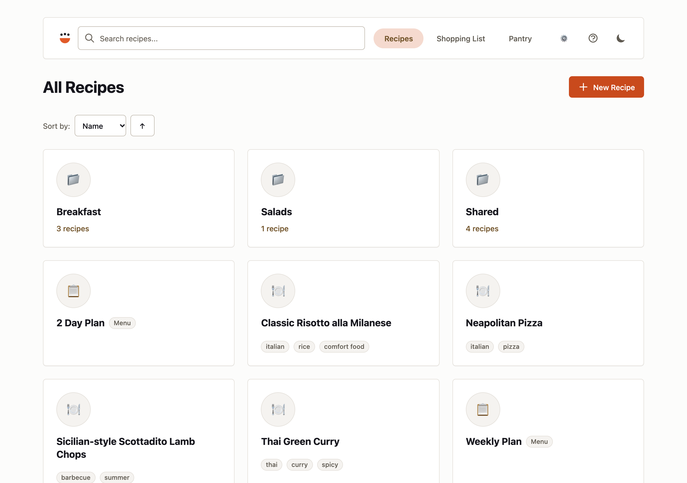
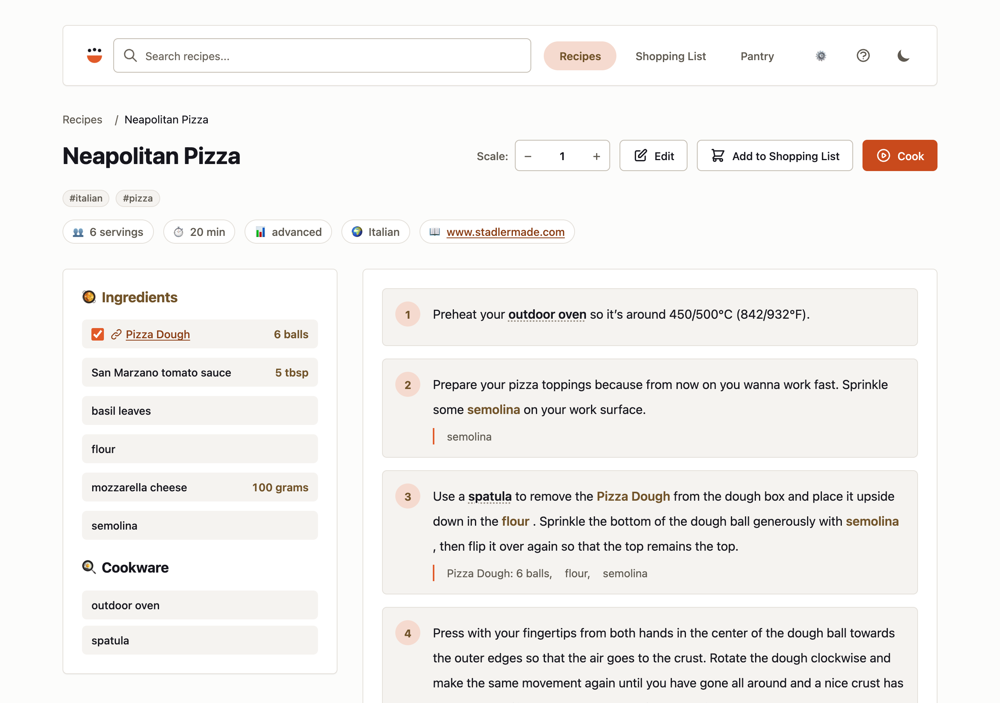
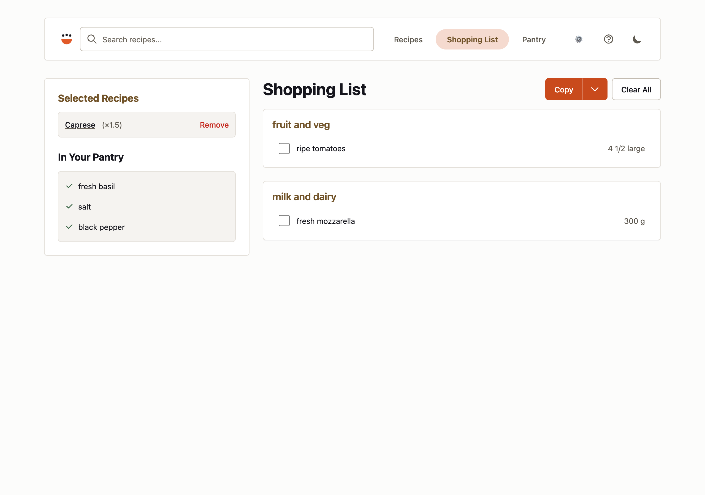
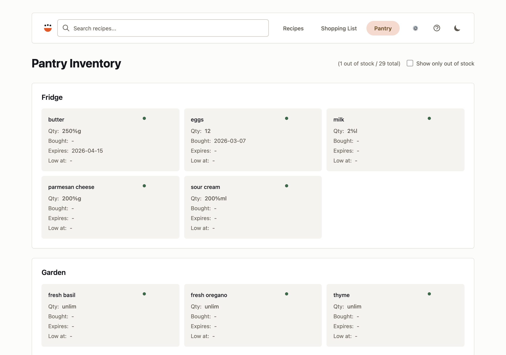

# Server Command

Start a local web server to browse and view your recipe collection.






## Usage

```
cook server [OPTIONS] [BASE_PATH]
cook server user <add|passwd|remove|list> [NAME] [--users-file <PATH>]
cook server hash-password
```

## Arguments

| Argument | Description |
|----------|-------------|
| `[BASE_PATH]` | Root directory containing recipe files (default: current directory) |

## Options

| Option | Description |
|--------|-------------|
| `--host [<ADDRESS>]` | Allow connections from external hosts (default: localhost only). Optionally bind to a specific address. |
| `-p, --port <PORT>` | Port number (default: 9080) |
| `--open` | Automatically open the web interface in your default browser |
| `--cors-origin <ORIGIN>` | Origin allowed to make cross-origin browser requests, and whose host the server answers at. Repeatable. `*` lets any origin read. Default: none, same-origin only. |
| `--cors-allow-credentials` | Allow cross-origin requests to carry cookies and credentials. Requires an explicit `--cors-origin`. |
| `--no-csrf-check` | Disable same-origin enforcement: the `Host` check, requests that modify recipes and the editor's language server connection. |
| `--max-lsp-sessions <N>` | Language server sessions to run at once (default: 8). `0` disables the editor's language server. |
| `--users-file <PATH>` | Users who may sign in to make changes. Defaults to `COOK_USERS_FILE`, then `users.toml` in the configuration directory. See [Signing in to make changes](#signing-in-to-make-changes). |

## Environment

| Variable | Description |
|----------|-------------|
| `COOK_CORS_ORIGIN` | Origins allowed to make cross-origin browser requests, and whose hosts the server answers at, separated by commas. Same values as `--cors-origin`, which overrides it. For containers, where passing a flag means restating the image's whole command. An empty value means "unset". |
| `COOK_CONFIG_DIR` | Global configuration directory, holding `aisle.conf`, `pantry.conf`, the cook.md session and the sync database. See [the README](../README.md#cook_config_dir). |

No other option can be set this way. `--no-csrf-check` in particular has to be passed on the command line.

## Examples

```bash
# Start on localhost:9080
cook server

# Serve recipes from a specific directory
cook server ~/my-recipes

# Custom port with auto-open
cook server --port 8080 --open

# Allow access from other devices on the network, which reach it by IP address
# (http://192.168.1.20:9080) and can both read and save
cook server --host

# Only for devices that open the web UI by host name instead: name that origin,
# or the server refuses to answer them
cook server --host --cors-origin http://nas.local:9080

# Let any website read the recipes (but not change them), as 0.37.0 and earlier did
cook server --cors-origin '*'

# Let a frontend at localhost:3000 use the full API, including writes
cook server --cors-origin http://localhost:3000

# Behind a reverse proxy that passes Host through, name the public origin
cook server --cors-origin https://cook.example.com

# Require sign-in before anyone can change recipes
cook server user add alice
cook server --host
```

## Notes

- By default, only accepts connections from localhost
- Use `--host` on trusted networks only — recipes become accessible to anyone on the network, and without [users](#signing-in-to-make-changes) anyone there can change them
- By default the server sends no CORS headers, so a page on another site cannot read anything from it, even though your browser can reach it. `--cors-origin '*'` lets any origin read (`GET`), as 0.37.0 and earlier did by default, while still refusing a cross-origin request that would modify recipes with `403`. Naming origins with `--cors-origin` lets those origins read and write, so a page you have not listed cannot change your recipes. See [the API reference](api.md).
- The server only answers requests sent to `localhost`, an IP address, such as `http://127.0.0.1:9080` or `http://192.168.1.20:9080`, or the host of a `--cors-origin`. Opened at any other host name — `http://nas.local:9080`, or a reverse proxy's `https://cook.example.com` that passes `Host` through — every request is refused with `403` until that origin is named with `--cors-origin`. Otherwise any website could point a domain of its own at your server (DNS rebinding) and read it, or pass for the web UI and change it. This applies to `curl` and other clients too: the `Host` is all the server can go by. The `403` and the server's log name the exact flag to add; only add origins you recognise.
- Behind a reverse proxy that rewrites `Host` to an IP address, such as `proxy_pass http://127.0.0.1:9080`, the check passes on its own, but writes from the web UI still need the public origin named (for example `--cors-origin https://cook.example.com`). The checks read the real `Host` header and ignore `X-Forwarded-Host`, which any client can set freely.
- The recipe editor talks to its language server over a websocket, which browsers exempt from CORS, so the server checks that connection's `Origin` itself, by the same rule: only its own page at `localhost` or an IP address, or a `--cors-origin`, may open it. Under any other host name the editor's completions and diagnostics stop until you name that origin. Whatever a client asks for, the language server only ever sees the directory being served.
- `--no-csrf-check` turns that same-origin enforcement off entirely: the `Host` check, the API, the web UI's new-recipe form and the editor's language server. Its former spelling, `--no-cors`, still works.
- The built-in editor gets its diagnostics and completions from a `cook lsp` subprocess, one per open edit tab, and the endpoint that starts them has no authentication unless [sign-in](#signing-in-to-make-changes) is on. `--max-lsp-sessions` caps how many run at once (8 by default) so that a client which is not that editor cannot spawn them without bound; beyond the cap the websocket handshake is refused with `503` and the editor retries. Under `--host`, consider `--max-lsp-sessions 0`, which serves the recipes but never starts a subprocess for a remote client.
- The web interface supports recipe browsing, scaling, search, editing, and shopping list management
- A recipe or menu that declares a whole number of `servings` is scaled by servings: the stepper starts at its own servings and goes from half a serving up, with no upper limit (`/recipe/Pizza?servings=3`). Any other keeps the multiplier (`?scale=1.5`, from 0.5 to 200). `?scale=` links still work on both and, on a recipe with servings, show as the servings they give. A menu links each recipe it references by servings when that recipe declares them (`?servings=4`), and by its factor otherwise (`?scale=2`)
- The UI language is negotiated per request from the browser's `Accept-Language` header — each visitor sees the interface in their own language (supported: `en-US`, `de-DE`, `nl-NL`, `fr-FR`, `es-ES`, `eu-ES`, `sv-SE`, `it-IT`, `ja-JP`). For static sites, see the `--lang` flag of [`cook build web`](build.md#localization).
- Mobile-friendly responsive layout

## Containers

The published image runs `cook server /recipes --host`, so nothing extra is needed to open the web UI at `http://localhost:9080`, or at the host's address on the network — both read and save. Reaching it by host name instead, directly or through a reverse proxy, means naming that origin, and `COOK_CORS_ORIGIN` does it without restating the image's command:

```yaml
services:
  cookcli:
    image: ghcr.io/cooklang/cookcli:latest
    ports:
      - "9080:9080"
    volumes:
      - ./recipes:/recipes
    environment:
      COOK_CORS_ORIGIN: https://cook.example.com
```

Name the origin the browser shows, so `https://` when the proxy terminates TLS, and separate several with commas. A container that calls the API from another container by its service name, `http://cookcli:9080`, needs that name too — `COOK_CORS_ORIGIN: https://cook.example.com,http://cookcli:9080` — but nothing else: it sends no `Origin` header.

## Signing in to make changes

Out of the box the server is open: anyone who can reach it can change your
recipes. Add a user, and it asks for sign-in before any change:

```bash
cook server user add alice   # asks for alice's password, twice
cook server
```

Once the server has users:

- Anyone can still browse recipes and menus, search, and look at the shopping
  list and the pantry.
- Creating, editing and deleting recipes, and changing the pantry or the
  shopping list, need a signed-in user whose [role](#roles) allows it. Guests
  see a **Sign in** link at the top of every page instead of the controls
  that change things.
- The editor's language server (`/api/ws/lsp`) is for those who may edit
  recipes, and the CookCloud sync controls for admins only.
- An API request that would change something, sent without a session, gets
  `401`; sent by a user whose role does not allow it, `403`.
  [The API reference](api.md) shows how a script signs in.

Users live on the server only: nobody can sign up or change a password from
the browser.

### Roles

Each user has a role, which decides what they can change once signed in. Each
role can do everything the ones above it can:

| Role | Shopping list & pantry | Recipes & menus (create, edit, delete, pictures) | CookCloud sync |
|------|:---:|:---:|:---:|
| `reader` | | | |
| `shopper` | ✅ | | |
| `editor` | ✅ | ✅ | |
| `admin` | ✅ | ✅ | ✅ |

Everyone, signed in or not, can read. A user added without `--role` is an
`admin`, which is what every user was before roles existed. Pages leave out
the controls a user's role cannot use.

```bash
cook server user add grandma --role reader
cook server user add kid --role shopper
cook server user role kid editor   # applies at once, without signing them out
```

### Managing users

| Command | What it does |
|---------|--------------|
| `cook server user add <name> [--role <role>]` | Add a user, asking for their password. Creates the users file if needed. The role defaults to `admin`. |
| `cook server user passwd <name>` | Change a user's password. |
| `cook server user role <name> <role>` | Change a user's [role](#roles). |
| `cook server user remove <name>` | Remove a user. |
| `cook server user list` | List the users and their roles. |
| `cook server hash-password` | Print a password hash, for editing the users file by hand. |

A username may use letters, digits and `_ . @ -`. The password prompt does not
echo what you type. When standard input is not a terminal, the password is
read from its first line instead, for scripts:

```bash
printf '%s\n' "$PASSWORD" | cook server user add alice
```

`user` has to come straight after `server`: in
`cook server --port 8080 user add alice`, `user` is read as the recipe
directory. Pass `--users-file` after the subcommand when you need it.

A running server picks up changes to the users file on its own. A new user can
sign in right away, a new role applies to the user's next request, and
removing a user or changing their password signs them out everywhere. The one
exception is the first user: sign-in turns on when the
server *starts* with a users file, so restart it once after creating one.

### The users file

`cook server` reads `users.toml` from the global configuration directory (see
[Configuration](../README.md#️-configuration)), unless `--users-file <PATH>`
or the `COOK_USERS_FILE` environment variable names another file. The flag
wins, and an empty variable counts as unset. The `user` commands edit the same
file and keep any comments in it.

```toml
# Who may change recipes on this server.
[users]
alice = "$argon2id$v=19$m=19456,t=2,p=1$…"                  # admin
bob = { hash = "$argon2id$v=19$m=19456,t=2,p=1$…", role = "editor" }
```

A bare hash is an admin; a table pairs a hash with a role. `user add` writes an
admin as a bare hash, so a server from before roles still reads the file. It
refuses one with any other role rather than make that user an admin.

- Sign-in is on whenever this file exists when the server starts. Delete it
  and restart to open the server to everyone again.
- An empty `[users]` table keeps sign-in on with nobody able to sign in, which
  makes the site read-only.
- The server will not start with a users file it cannot use — one it cannot
  read, a malformed entry, an unknown role, a file named with `--users-file`
  that does not exist — rather than fall back to letting everyone in. While it runs, an edit
  that breaks the file is ignored: the server logs an error and keeps the
  users it had.
- The server refuses a users file inside the recipe directory, because it
  publishes that directory's files at `/api/static/`.

### Sessions and HTTPS

Signing in sets a `cook_session` cookie that lasts 30 days. The server signs it
with a key it keeps in `auth-secret`, next to `users.toml` in the
configuration directory. Delete that file and restart to sign everyone out.

Signing out ends that session on the server too, so a copy of the cookie left
in another browser or a log stops working; the user's other sign-ins are not
affected. The server records the session in `revoked-sessions`, beside
`auth-secret`, until the cookie would have expired anyway. Deleting that file
brings the signed-out sessions back, so delete `auth-secret` with it. If the
configuration directory cannot be written, the server uses a temporary key,
and everyone has to sign in again after a restart.

Over plain HTTP, passwords and cookies cross the network in the clear. Before
exposing the server beyond a network you trust, put it behind a reverse proxy
that serves HTTPS, and have the proxy send `X-Forwarded-Proto: https` so the
cookie is marked `Secure`.

In a container, give the server a configuration directory it can write to;
see [Sign-in in a container](../README.md#sign-in-in-a-container).

## Activity log

The server prints a line on standard output for every change made through it,
saying when, who, and what — in the terminal, or in `docker logs`:

```text
2026-09-27 08:41:56 alice signed in
2026-09-27 08:42:03 alice created recipe "Soups/Pea soup.cook"
2026-09-27 08:42:40 alice updated recipe "Soups/Pea soup.cook"
2026-09-27 08:43:12 alice added "Soups/Pea soup.cook" ×2 to the shopping list
2026-09-27 08:43:30 alice checked off "flour" on the shopping list
2026-09-27 08:44:05 alice removed "milk" from the "dairy" section of the pantry
2026-09-27 08:45:51 alice deleted menu "Week.menu"
2026-09-27 08:46:00 alice signed out
2026-09-27 09:12:44 guest failed to sign in
```

It covers recipes and menus (created, updated, deleted, title or step picture
set or removed), the shopping list, the pantry, linking the server to cook.md, and
signing in and out. Changes are attributed to the signed-in user; without
[sign-in](#signing-in-to-make-changes), and for a failed sign-in, to `guest`.
A failed sign-in never shows the name that was typed, since that is sometimes
the password. Names and paths are quoted, so a line break in one cannot pass
for another line. Times are the server's local time. The container image has
no time zone data, so it logs in UTC unless you mount the host's zone, e.g.
`-v /etc/localtime:/etc/localtime:ro`.

Changes made to the files directly, outside the server, are not listed.

## Meal plans

Any menu with sections on two days or more is a meal plan, laid out as a calendar. A section is for a day when its name holds a `YYYY-MM-DD` date, as the **Today's menu** banner reads it:

```
---
title: October fortnight
servings: 2
---

== Wednesday (2026-10-07) ==

Breakfast: \
-

Dinner: \
- @./Risotto{2%servings}

= 2026-10-08 Dinner

- @./Soup{}
```

- Nothing else marks a plan: the shopping list, `cook shopping-list` and other Cooklang apps read it as they read any menu. Several sections may share a day. Text after the date names the meal for the section's lines before its first meal header, so `= 2026-10-08 Dinner` is a dinner.
- **New Meal Plan**, beside **New Menu** on the recipe list, writes one: pick its first day (any day of the week), how many days it lasts (2 to 62), its meals and its servings. It has a section for every day, with an empty bullet under each meal to fill in the editor; day and meal names are written in the page's language.
- The plan shows as one card a day, from its first dated day to its last, in weekday columns on a wide screen (weeks start on Sunday for `en-US` and `ja-JP`, Monday otherwise) and one under the other on a phone. A day with no section still gets a card, but a week with none is left out. Every day offers a slot for each meal the plan's days name (`Breakfast:`), in the order they first appear, even when nothing is planned. The reader's own clock marks today and greys the days gone by.
- A section with no date is listed under **Outside this plan**. A menu with a single dated day shows as an ordinary menu.
- **Some days to the shopping list.** Those who may change the shopping list get a checkbox on each day, with **All**, **Next 7 days** and **None** shortcuts, and **Add days to shopping list**. Only those days' recipes go on the list, at the plan's servings, and the ingredients written straight into those days (`@almonds{50%g}`) go on as items of their own, added up when several days name them. **Add All to Shopping List** still adds the whole plan as one entry. Both are written in the `.shopping-list` format the Cooklang apps share: the days' recipes as ordinary recipe lines and their ingredients as free-hand lines, so the list removes them one by one rather than as a menu.

## Web feeds

The server publishes an Atom feed at `/atom.xml` and an RSS 2.0 feed at `/rss.xml`, with one item per recipe and menu, newest first. They are built from the recipe files on each request, so they are always up to date. Every page advertises them with `<link rel="alternate">` tags, so a feed reader finds them from the site's address alone.

Items use the same metadata as the static site's feeds (`title`, `date`, `description`, `author`, `tags`); see [Web feeds](build.md#web-feeds). The feed title and language follow the request's `Accept-Language` header.

Feed links are absolute. They are built from the request's `Host` header and `--url-prefix`. Behind a TLS-terminating reverse proxy, send `X-Forwarded-Proto: https` to get `https://` links. As with the same-origin check, `X-Forwarded-Host` is ignored, so the proxy must pass the public `Host` through.

## Title and step pictures

The recipe editor's **Picture** button adds, replaces or removes a recipe's pictures without touching the server's files directly: its title picture — the `Recipe.jpg` next to `Recipe.cook` that the recipe page and the recipe list show — and the picture of each step, shown above the step on the recipe page and in cooking mode. Pick the title or a step in the dialog's **Picture for** list, then choose a file or drop one on the dialog. On the recipe page, the camera button beside a step opens the editor with that step picked; it is shown to those who may edit recipes.

- JPEG, PNG and WebP are accepted. The browser scales a photo down before sending it, so a phone photo of several megabytes goes up as a few hundred kilobytes; the server takes at most 10 MB.
- Every picture is saved as JPEG: turned upright from the photo's orientation data, scaled down to 2048 px on its longer edge, laid over white where it is transparent, and always re-encoded on the server — never stored as sent — so a malformed or doctored file cannot reach the recipe folder.
- Re-encoding drops the photo's metadata, including its GPS location.
- A title picture is saved as `Recipe.jpg`. An older `Recipe.jpeg`, `Recipe.png` or `Recipe.webp` is removed when a new one is saved. Step pictures are never touched.
- A step picture is saved as `Recipe.S.N.jpg`: step N of section S, both counted from 1, as the Cooklang iOS app names them. The recipe page also shows a `Recipe.N.jpg` with the step counted across every section, so saving or removing a step's picture clears both names in every extension. The title picture and other steps' pictures are never touched.
- A step picture belongs to the step's position, not its text: adding or removing an earlier step in the same section moves it onto another step. The dialog saves the recipe before listing its steps, so they are numbered as the recipe page numbers them.
- HEIC and AVIF photos cannot be read by the server. An iPhone's own browser converts a HEIC photo to JPEG as it uploads it, and so does Safari on a Mac; from another browser, export the photo as JPEG first, or set the iPhone camera to **Most Compatible** (Settings › Camera › Formats).
- A recipe whose metadata names a picture (`image:` in its frontmatter) shows that one as its title picture instead. The dialog says so; remove the line to use an uploaded picture.

The dialog uses `/api/recipe_image/{*path}`; see [the API reference](api.md).
